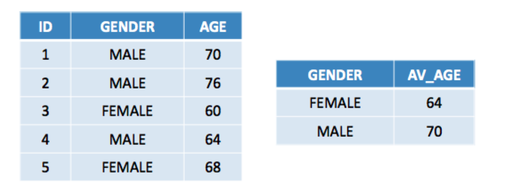
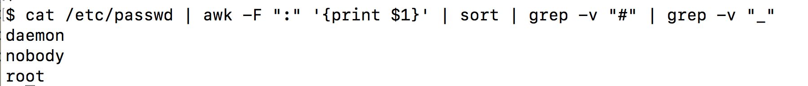

# The tidyverse

The **dplyr** package is part of the larger **tidyverse** package set which has expanded considerably in recent years and continues to grow in size and utility such that many people never learn the "older way" of doing things in R. But we've already been through that in the previous section. The tidyverse has the following packages. The descriptions have been lifted from the [tidyverse home page](https://www.tidyverse.org/packages/).

**ggplot2** - ggplot2 is a system for declaratively creating graphics, based on The Grammar of Graphics. You provide the data, tell ggplot2 how to map variables to aesthetics, what graphical primitives to use, and it takes care of the details.

**dplyr** - dplyr provides a grammar of data manipulation, providing a consistent set of verbs that solve the most common data manipulation challenges. 

**tidyr** - tidyr provides a set of functions that help you get to tidy data. Tidy data is data with a consistent form: in brief, every variable goes in a column, and every column is a variable.

**readr** - readr provides a fast and friendly way to read rectangular data (like csv, tsv, and fwf). It is designed to flexibly parse many types of data found in the wild, while still cleanly failing when data unexpectedly changes.

**tibble** - tibble is a modern re-imagining of the data frame, keeping what time has proven to be effective, and throwing out what it has not. Tibbles are data.frames that are lazy and surly: they do less and complain more forcing you to confront problems earlier, typically leading to cleaner, more expressive code. 

**stringr** - stringr provides a cohesive set of functions designed to make working with strings as easy as possible. It is built on top of stringi, which uses the ICU C library to provide fast, correct implementations of common string manipulations.

**lubdriate** - Date-time data can be frustrating to work with in R. R commands for date-times are generally unintuitive and change depending on the type of date-time object being used. Moreover, the methods we use with date-times must be robust to time zones, leap days, daylight savings times, and other time related quirks. Lubridate makes it easier to do the things R does with date-times and possible to do the things R does not.

## Installing

You will probably use a number of functions from several of these packages so it's best to go ahead and install the entire **tidyverse** in one go. To install it, do one of the following: 

1) At the R Console from within RStudio, type:

```{r eval=FALSE}
install.packages("tidyverse")
```

2) Use the Tools -> Install Packages menu item in RStudio:

{width=400}

After you have installed the package you may load it by doing:

```{r}
suppressMessages(library(tidyverse))
```

Note that the **cheatsheet** for **dplyr** can be [found here](https://github.com/rstudio/cheatsheets/blob/master/data-transformation.pdf)


## dplyr Basics

**dplyr** is a grammar of data manipulation, providing a consistent set of verbs that help you solve the most common data manipulation challenges. In fact if you were paying attention during the opening section on data frames you will have noticed that most of the activities we performed related to the following activires. In dplyr-speak there are the **verbs** that help us get work done.


    mutate() - adds new variables that are functions of existing variables
    select() - picks variables based on their names.
    filter() - picks cases based on their values.
    summarise() - reduces multiple values down to a single summary.
    arrange() - changes the ordering of the rows.


## First Steps

Note that this material references ["Becoming a data ninja with dplyr"](https: //speakerdeck.com/dpastoor/becoming-a-data-ninja-with-dplyr) as well as [this dplyr tutorial]( http://genomicsclass.github.io/book/pages/dplyr_tutorial.html)

We'll go back to the basics here by using a very small data frame which will make it clear how the various **dplyr** verbs actually work:

```{r}
df <- data.frame(id = 1:5,
                 gender = c("MALE","MALE","FEMALE","MALE","FEMALE"),
                 age = c(70,76,60,64,68))
```

{width=400}


### filter()

The **filter()** function allows us to sift through the data frame to find rows that satisfy some logical condition. (With the older approach we would be using the bracket notation). The following example allows is to find only the observations relating to a declared gender of **female**.

```{r}
filter(df,gender == "FEMALE")

# Given this data frame, the following is equivalent 

filter(df, gender != "MALE")
```


So, now find only the **ids** that relate to rows 1,3, or 5. This is a highly specialized search but it is helpful to show that you can use a wide variety of logical constructs.

```{r}
filter(df, id %in% c(1,3,5))
```


### mutate()

Mutate is used to add or remove columns in a data frame. Let's create a new column in the data frame that contains the mean value of the age column.

```{r}
mutate(df,meanage = mean(age))
```


Next we will create a new column designed to tell us if a given observation has an age that is greater than or equal to the average age. Specifically, create a variable called **old_young** and assign a value of "Y" if the observed age for that row is above the mean age and a value of "N" if it is not.

```{r}
mutate(df,old_young=ifelse(df$age>=mean(df$age),"Y","N"))
```

One way we could use something like this is in making a plot where the observations exhibiting an age value above the mean are plotted in a certain color and those below the mean are in another color.

```{r}
tmp <- mutate(df, color = ifelse(age > mean(age),"red","blue")) 

plot(tmp$age,col=tmp$color, type="p",
     pch=19,main="Ages",ylab="Age") 

grid()

abline(h=mean(tmp$age),lty=2)

legend("topright",
       c("Above Avg","Below Avg"),col=c("red","blue"),pch=19)
```

### arrange()

Use arrange for sorting the data frame by one or more columns. When using the basic data frame structure from R we had to use the **order()** function to help us generate a vector that has the row numbers of the data frame that correpsond to the desired order of display (lowest to highest, etc). 

Let's sort the data frame **dff** by age from oldest to youngest.
First we'll use the older approach. While this will work, it is not exactly very intuitive.

```{r}
df[rev(order(df$age)),]
```

**dplyr** makes this process more simple - at least in my opinion

```{r}
arrange(df,desc(age))
```

Next, let's sort **df** by gender (alphabetically) and then by age
from olderst to youngest. The rows relating to a gender of **female** are going to be listed first because, alphabetically speaking, the letter "F" comes before the letter "M". Then within those categories we have the ages sorted from oldest to youngest.

```{r}
arrange(df, gender,desc(age))
```

If we used the older approach it would look like the following. Ugh !

```{r}
df[order(df$gender,-df$age),]
```

### select()

The select() functions allows us to select one or more columns from a data frame.

```{r}
# Reorder the columns
select(df,gender,id,age)  
```


```{r}
# Select all but the age column
select(df,-age)
```

```{r}
# Can use the ":" operator to select a range
select(df,id:age) 
```

The select() function provides the ability to select by "regular expressions"" or numeric patterns:

```{r}
# Select all columns that start with an "a"
select(df,starts_with("a"))
```

```{r}
names(mtcars)

# Get only columns that start with "c"

select(mtcars,starts_with("c"))
```

This example is more realistic in that data frames can have a large number of columns named according to some convention. For example, the measurements on a patient might not be labelled specifically - they might have a common prefix such as "m_" followed by some sequential number (or not). 

```{r}
testdf <- expand.grid(m_1=seq(60,70,10),
                      age=c(25,32),
                      m_2=seq(50,60,10),
                      m_3=seq(60,70,10))
```


```{r}
testdf
```


Find all the columns that include a "_" character

```{r}
select(testdf,matches("_"))
```

This will select columns beginning with "m_" but only those with a suffx of 1 or 2.

```{r}
select(testdf,num_range("m_",1:2))
```

### group_by()

The **group_by()** function let’s you organize a data frame by some factor or grouping variable. This a very powerful function that is typically used in conjunction with a function called **summarize**. Here is what it looks like by itself. It's somewhat underwhelming. It does seem to create table of some kind but it doesn't do much else. 

```{r}
df

# Hmm. the following doesn't do anything - or so it seems

group_by(df)
```

So as mentioned, the **group_by** function is usually paired with the **summarize** function. Ah. so what this does is to first group the data frame by the **gender** column and then it **counts** the number of occurrences therein. So this is a form of aggregation.

```{r}
summarize(group_by(df,gender),total=n())
```


Let's group the data frame by gender and then compute the average age for each group.

```{r}
summarize(group_by(df,gender),av_age=mean(age))
```



Let's group by gender and then compute the total number of observations in each gender group and then compute the mean age. 

```{r}
summarize(group_by(df,gender),av_age=mean(age),total=n())
```

# Split Apply Combine

This pattern of using **group_by()** followed by **summarize()** 
is called **Split Apply Combine**. The idea is that we 

1) Split up the data frame by gender group
2) Then for each group, apply the average function
3) Then combine the average results for each group

```{r}
summarize(group_by(df,gender),av_age=mean(age))
```

{width=600}


## What Are Pipes ?

Before moving forward let us consider the "pipe" operator that is included with the dplyr - well actually **magrittr** package. This is used to make it possible to "pipe" the results of one command into another command and so on.

The inspiration for this comes from the UNIX/LINUX operating system where pipes are used all the time. So in effect using "pipes" is nothing new in the world of research computation. 



**Warning:** Once you get used to pipes it is hard to go back to not using them. 

Let’s use the mtcars data frame to illustrate the basics of the piping mechanism as used by dplyr. Here we will select the **mpg** and **am** column from mtcars and view the top 5 rows.

```{r}
head(select(mtcars, mpg, am))
```

Okay, how would we do this using pipes ? Whoa ! Note that each command is "it's own thing" independently of the pipe character. 
So the:
      - output of mtcars goes into the 
      - input of the **select** function whose output goes into the
      - input of the **head** function

```{r}
mtcars %>% select(mpg, am) %>% head
```

Break this down:

```{r}
mtcars %>% select(mpg, am)
```

The key to understanding how this works is to **read** this from left to right. It bears repeating that each command is "it's own thing" independently of the pipe character. So the:

    - output of mtcars goes into the 
    - input of the **select** function whose output goes into the
    - input of the **head** function

Let's use our new found knowledge to re-imagine our use of the **group_by** and **summarize** functions that we have been using in **composite** form up unitl now. 

## Using Pipes To Do Split-Apply-Combine

```{r}
df %>% group_by(gender) %>% summarize(avg=mean(age))

# Same as the following but the pipes don't require you to "commit"
# With the following, you have to know in advance what you want to do

summarize(group_by(df,gender), avg=mean(age))
```

This approach allows us to build a "pipeline" containing commands. We don't have to commit to a specific sequence of functions. This enables a free-form type of exploration.

```{r}
df %>% 
  group_by(gender) %>% 
  summarize(avg=mean(age),total=n())
```

What is the median age of all males ? 

```{r}
df %>% 
  filter(gender == "MALE") %>% 
  summarize(med_age=median(age))
```


### Saving Results

It should be observed that if you want to save the results of some sequence of commands that you will need to use the "<-" operator. Using the previous example we could the following to save our result.

```{r}
results <- df %>% 
              filter(gender == "MALE") %>% 
              summarize(med_age=median(age))
```


## An Example 

Using the built in mtcars dataframe, do the following:
   
   1) **filter** for records where the wt is greater than 3.3 tons.

   2) Then, using the **mutate** function to create a column called 
      ab_be (Y or N) that indicates whether that observation’s 
      mpg is greater (or not) than the average mpg for the filtered set.

   3) Then present the average mpg for each group. 
   
This is easy using pipes and dplyr verbs. 

```{r}
mtcars %>% filter(wt > 3.3)  %>%
           mutate(ab_be=ifelse(mpg > mean(mpg),"Y","N")) %>%
           group_by(ab_be) %>% 
           summarize(mean_mpg=mean(mpg))
```

This could be then "piped" into the input of the **ggplot** command to plot a  corresponding bar chart. If you don't yet know ggplot then it's okay as this will nudge you in that direction. Both **ggplot** and **dplyr** are part of the **tidyverse** which means that the two packages "talk" to each other well. 

```{r}
mtcars %>% filter(wt > 3.3)  %>%
           mutate(ab_be=ifelse(mpg > mean(mpg),"Y","N")  ) %>%
           group_by(ab_be) %>% summarize(mean_mpg=mean(mpg)) %>%
           ggplot(aes(x=ab_be,y=mean_mpg)) +
           geom_bar(stat="identity") +
           ggtitle("Mean MPG") + labs(x = "ab_be", y = "Mean MPG")
```

## Working With Flowers

Let's work with the built in **iris** data frame to explore the world of flowers. This is famous (Fisher's or Anderson's) **iris** data set gives the measurements in centimeters of the variables sepal length and width and petal length and width, respectively, for 50 flowers from each of 3 species of iris. The species are Iris setosa, versicolor, and virginica.  

I'll use dyplr idioms here as opposed to the typical Base R approach which might involve use of composite functions. First, load up the iris data 

```{r}
data(iris)
```


### Structure of The Data frame 

It's always helpful to look at what types of data you have in a data frame. As you already known, base R has a function called **str** which is useful. The tidyverse equivalent is **glimpse** although the two commands basically provide the same types of information. Personally, I still prefer the "old" **str** function if only because I've been using it for so long. 

```{r}
str(iris)
```

```{r}
glimpse(iris)
```


### More Practice

1) Get all the rows where the Species is "setosa" Sepal.Length is > 4.7 
but < 5.0. Use the pipes feature to help you with this.

```{r}
iris %>% 
  filter(Sepal.Length > 4.7 & Sepal.Length < 5.0 & Species=="setosa" )
```

2) Select out only the columns relating Sepal measurements. List only the top five rows:

```{r}
iris %>% select(c(Sepal.Length,Sepal.Width)) %>% head(5)

# Or use a helper function to process strings

iris %>% select(starts_with("Sepal")) %>% head(5)

# Or if you know which column numbers you want

iris %>% select(c(1:2)) %>% head(5)
```

3) Sort the data frame by Sepal.Width such that the row with the largest Sepal.Width is listed first. Print only the first 5 rows

```{r}
iris %>% arrange(desc(Sepal.Width)) %>% head(5)
```


4) How many observations are there for each Species group ? 

```{r}
iris %>% group_by(Species) %>% count()

# Or

iris %>% group_by(Species) %>% summarize(total=n())
```

5) Select all columns that do NOT relate to Length. Limit output to 5 rows

```{r}
iris %>% select(-ends_with("Length")) %>% head()
```

6) Select all columns that do NOT relate to Length or Species. Limit output to 5 rows

```{r}
iris %>% select(-c(ends_with("Length"),"Species")) %>% head()

# Or

iris %>% select(-ends_with("Length")) %>% select(-"Species") %>% head()
```

7) Select all columns that do NOT relate to Length or Species. But only for observations where Sepal.Width is > 3.9.  There are multiples way to attack this problem.


```{r}
iris %>% filter(Sepal.Width > 3.9) %>% 
  select(-ends_with("Length")) %>% 
  select(-"Species")

# Or

iris %>% select(-ends_with("Length")) %>% 
  select(-"Species") %>%
  filter(Sepal.Width > 3.9) 
```

8) Determine the mean, standard deviation, max, and min for Sepal.Length

```{r}
iris %>% summarize(mean=mean(Sepal.Length),
                   sd=sd(Sepal.Length),
                   max=max(Sepal.Length),
                   min=min(Sepal.Length))
```


9) For each Species type, determine the mean, standard deviation, max, and min for Sepal.Length

```{r}
iris %>% group_by(Species) %>% summarize(mean=mean(Sepal.Length),
                                         sd=sd(Sepal.Length),
                                         max=max(Sepal.Length),
                                         min=min(Sepal.Length))
```

# Your Turn

Now it's time for you to try some exercises on your own. The **ggplot2** package (which is part of the larger **tidyverse** comes with some data sets one of which is called **msleep**. It's easy to load into your workspace:

```{r}
data(msleep)
```

This data set is 

 > an updated and expanded version of the mammals sleep dataset. Updated sleep times and weights were taken from V. M. Savage and G. B. West. A quantitative, theoretical framework for understanding mammalian sleep. Proceedings of the National Academy of Sciences, 104 (3):1051-1056, 2007

{width=600}

You can always get the names of the columns in a data frame using **str** or **names**

```{r}
names(msleep)

#

str(msleep)
```


Not only is this a new data frame for you it also has the added challenge of containing some missing values - those pesky "NAs". In the older approach we used the function **complete.cases** to help us figure out which rows had at least one missin value. We could still use that here although the **dplyr** world has a function called **drop_na()** which could be used but itself or as part of a pipeline. 


Here are some questions I want you to answer. Note that the answers are provided so you can check your work. However, the code used to generate the answer is not visible. There is typically more than one way to answer the question. 


#### What is the average total sleep time for Omnivores ? 

```{r echo=FALSE}
msleep %>% filter(vore=="omni") %>% summarize(mean=mean(sleep_total))

# Or

msleep %>% group_by(vore) %>% 
  summarize(mean=mean(sleep_total)) %>% 
  filter(vore=="omni")
```


#### Group the msleep data frame by taxanomic order and then summarize the mean sleep total for each group. Make sure the resulting table is arranged in descending order of the average - from highest sleep_total average to the lowest


```{r echo=FALSE}
msleep %>% 
  group_by(order) %>% 
  summarize(avg=mean(sleep_total)) %>%
  arrange(desc(avg))
```

#### What is the average total sleep time for all vore types ? 


```{r echo=FALSE}
msleep %>% group_by(vore) %>% 
  summarize(mean=mean(sleep_total))
```


#### Omitting any rows that contain missing values, what is the average total sleep time for all vore types ? Remember that you will need to use the **drop_na** function to help you. 

```{r echo=FALSE}
msleep %>% 
  drop_na() %>% 
  group_by(vore) %>% 
  summarize(mean=mean(sleep_total))
```


#### Remove all rows that contain a missing value and save the result into a new data table called **msleep_na**. How many rows does msleep_na contain ? 

```{r echo=FALSE}
msleep_na <- msleep %>% drop_na()
msleep_na %>% nrow()
```


#### Using msleep_na, find the average braintwt for all vores by order. Note that the group_by() function can take multiple arguments. 

```{r echo=FALSE}
msleep_na %>% 
  group_by(order,vore) %>% 
  summarize(mean=mean(brainwt))
```


# Taking It To The Next Level

Here we look at some data obtained from the City of Chicago Open Data Portal <https://data.cityofchicago.org/>. This is data that represents phone calls to the police during the year of 2012. Just pick a folder on your hard drive and download the data. 


```{r eval=FALSE}
url <- "http://steviep42.bitbucket.org/YOUTUBE.DIR/chi_crimes.csv"

download.file(url,"chi_crimes.csv")

```
